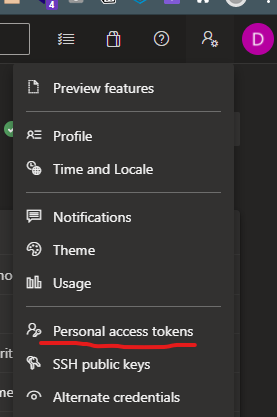

# clone_repo_from_azure_kroton

clona os repositorios do time mapeada nas configurações.

# Informações

- WORKING_DIRECTORY: diretório em que o repositório irá manter os projetos.
- AZURE_ORG_URL: url do repository da azure.
- AZURE_PERSONAL_ACCESS_TOKEN: token obtido na url acima;
  

# Setup

- informar o diretorio em que irá clonar os repostórios em .env "WORKING_DIRECTORY"
  - exemplo:
    `/usr/daniel/projects`
- gerar token de acesso personlizado no "dev.azure"

# Comandos

```bash
# instalar dependencias
yarn

# rodar projeto
yarn dev:server
```
